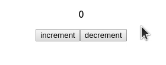
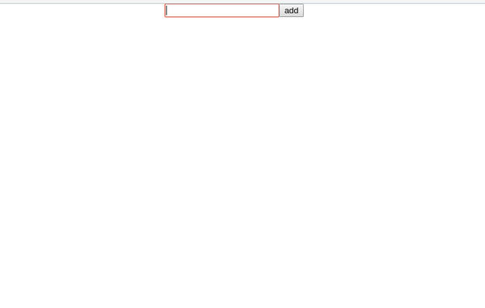
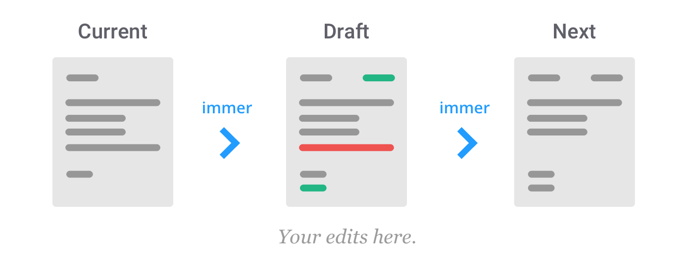

## Redux の記述量多すぎなので、 Redux の公式ツールでとことん楽をする ( redux-starter-kit)

Redux Hooks がリリースされたおかげで、Redux の store とコンポーネントのつなぎ込みが簡単になりました。

今回は Redux チームが公式にリリースしている [`redux-starter-kit`](https://redux-starter-kit.js.org/) を利用すると、Action、Reducer 部分もかなり簡潔に記述できるというお話です。

Redux Hooks については以下の記事を参照してください。

[Redux Hooks によるラクラク dispatch & states](https://qiita.com/Ouvill/items/569384e5c8c7ce78f98e)

## redux-starter-kit とは？

Redux チームが公式にリリースしているReduxを簡潔に記述するためのツールです。

ほぼ定形となる reducer, action 部分を省略して記述できます。

よく似た名前で[`react-redux-starter-kit`](https://github.com/davezuko/react-redux-starter-kit) がありますが、こちらはボイラーテンプレートとなり、まったくの別物です。（……そしてすでに開発終了）

## インストール

npm の場合

```sh
npm install -y redux-starter-kit
```

yarn の場合

```sh
yarn add redux-starter-kit
```

## カウンターを作ってみよう

redux-starter-kit を用いて、カウンターを作ってみましょう。



カウンターくらいわざわざ Redux を利用しなくてもいいと思いますけど、そこは突っ込まないお約束……

```
npx create-react-app　counter
```

上記でReact のテンプレートを生成し、そこからカスタマイズします。

まずソースコードをペタリと。解説は下の方

`src/modules/counterModule.js`: Actions, Reducers の作成。これだけです。
```js
import { configureStore, getDefaultMiddleware } from "redux-starter-kit";

// createSlice() で actions と reducers を一気に生成
const counterModule = createSlice({
    slice: "counter",
    initialState: 0,
    reducers: {
        increment: (state, action) => state + 1,
        decrement: (state, action) => state - 1
    }
});

export default counterModule;
```

`src/store.js` ストアの準備

```js
import { combineReducers, configureStore, getDefaultMiddleware  } from "redux-starter-kit";
import logger from "redux-logger";
import counterModule from "./modules/counterModule";

// rootReducer の準備
const rootReducer = combineReducers({
    counter: counterModule.reducer
});

// setup 関数を用意してエクスポートする。
export const setupStore = () => {
    const middlewares = [...getDefaultMiddleware(), logger];

    const store = configureStore({
        reducer: rootReducer,
        middleware: middlewares,
    });
    return store
}
```

`src/index.js`: Redux と React の連携

```jsx
import React from "react";
import ReactDOM from "react-dom";
import App from "./App";
import { Provider } from "react-redux";
import { setupStore } from "./store";

const store = setupStore();

ReactDOM.render(
  <Provider store={store}>
    <App />
  </Provider>,
  document.getElementById("root")
);
```

`src/App.js`: コンポーネント

```jsx
import React from "react";
import logo from "./logo.svg";
import { useDispatch, useSelector } from "react-redux";
import counterModule from "./modules/counterModule";

const App = () => {
    // dispatch の取得
  const dispatch = useDispatch();
    // state の取得
  const counter = useSelector(state => state.counter);

  const increment = () => dispatch(counterModule.actions.increment());
  const decrement = () => dispatch(counterModule.actions.decrement());

  return (
    <div className="App">
      <p>{counter}</p>
      <button onClick={increment}>increment</button>
      <button onClick={decrement}>decrement</button>
    </div>
  );
};

export default App;
```

ソースコードはここまで。Redux にしては異常に記述量が少ないと思いませんか？

それでは解説です。

### actions, reducers の作成（Ducks スタイル）

まずは action, reducer を記述します。

一般に Redux では、`actions/*****Action.js` と `reducers/*****Reducer.js` というふうにソースコードをわけて記述します。

しかし、redux-starter-kit の真価を発揮するのは、関係のある actions と reducers を一箇所に記述して、モジュールとする [Ducks](https://github.com/erikras/ducks-modular-redux) スタイルです。なので、今回は Ducks スタイルで記述します。

`src/modules/counterModule.js`

```js
import { configureStore, getDefaultMiddleware } from "redux-starter-kit";

// createSlice() で actions と reducers を一気に生成
const counterModule = createSlice({
    slice: "counter",
    initialState: 0,
    reducers: {
        increment: (state, action) => state + 1,
        decrement: (state, action) => state - 1
    }
});

export default counterModule;
```

以上で、actions と reducers の記述は完了です。み、短い。

`createSlice()` によって、actions と reducers を一気に生成しています。

counterModule の中に、actions と reducers がそれぞれ格納されています。

actions を利用する場合、以下のように呼びます。

```js
// incrementAction
counterModule.actions.increment()
// decrementAction
counterModule.actions.decrement()
```

redux-starter-kit で生成された actions は以下のような payload 形式のピュアな action オブジェクトを生成します。

```js
counterModule.actions.increment()

// => {type: "counter/increment", payload: undefined}
```

type には `"slice" で指定した名前/Action名` が入ります。今回の場合 `slice : "counter"` が名前空間のように作用し、actions の名前かぶりを回避します。
payload には、action の引数が入ります。今回は引数を指定していないため、`undefined` がセットされています。

payload に値をセットする場合、引数を指定すればいいです。

```js
counterModule.actions.increment(3)

// => {type: "counter/increment", payload: 3}
```

reducers は以下のように呼びます。

```js
counterModule.reducers
```

### store を用意する

actions と reducers が用意できたので、次は Redux の store を用意しましょう。

`src/store.js`

```js
import { combineReducers, configureStore, getDefaultMiddleware  } from "redux-starter-kit";
import logger from "redux-logger";
import counterModule from "./counterModule";

// rootReducer の準備
const rootReducer = combineReducers({
    counter: counterModule.reducer
});

// setup 関数を用意してエクスポートする。
export const setupStore = () => {
    const middlewares = [...getDefaultMiddleware()];

    // only development
    if (process.env.NODE_ENV === `development`) {
        middlewares.push(logger);
    }

    const store = configureStore({
        reducer: rootReducer,
        middleware: middlewares,
    });

    return store}
```

redux-starter-kit からは　`combineReducers`, `configureStore`, `getDefaultMiddleware` の3つのメソッドを呼んでいます。

redux-starter-kit を用いることで、デバッグしやすい環境を構築できます。

`combineReducers` は `redux` のものと一緒です。

`configureStore` によって store を生成します。`Redux DevTools Extension` のサポートを自動で有効にします。`Redux DevTools Extension` では、state 変化や dispatch の検出、テストコードの自動生成、タイムトラベリングデバッグを可能にします。

`getDefaultMiddleware()` では以下のような便利なミドルウェアを一発で導入できます。

- `redux-immutable-state-invariant`: reducers の中で mutation（オブジェクトの変化）がないか監視して、検出したらエラーを表示する。
- `serializable-state-invariant-middleware`: state のなかにシリアライズできないオブジェクト (function, Promise) が含まれていないか監視し、エラーを表示する。
- `thunk`: 非同期処理を取り扱えるようにする。

以上のうち、`redux-immutable-state-invariant`, `serializable-state-invariant-middleware` の 2つは development ビルドにしか含まれず、production ビルド時には自動的に取り除かれます。

### Provider

store も用意できたので、react と redux をつなげましょう。まず、React のルートコンポーネント付近に、`Provider`を配置します。

`src/index.js`

```jsx
import React from "react";
import ReactDOM from "react-dom";
import App from "./App";
import { Provider } from "react-redux";
import { setupStore } from "./store";

const store = setupStore();

ReactDOM.render(
  <Provider store={store}>
    <App />
  </Provider>,
  document.getElementById("root")
);
```

あとは、Redux Hooks を利用して、コンポーネントを記述するだけ。

`scr/App.js`

```jsx
import React from "react";
import logo from "./logo.svg";
import { useDispatch, useSelector } from "react-redux";
import counterModule from "./modules/counterModule";

const App = () => {
    // dispatch の取得
  const dispatch = useDispatch();
    // state の取得
  const counter = useSelector(state => state.counter);

    // ハンドラーを作成
  const increment = () => dispatch(counterModule.actions.increment());
  const decrement = () => dispatch(counterModule.actions.decrement());

  return (
    <div className="App">
      <p>{counter}</p>
      <button onClick={increment}>increment</button>
      <button onClick={decrement}>decrement</button>
    </div>
  );
};

export default App;
```

最新の Redux Hooks を利用することで、記述量を減らしています。

前述しましたが、Redux Hooks についてはこちらをどうぞ。

[Redux Hooks によるラクラク dispatch & states](https://qiita.com/Ouvill/items/569384e5c8c7ce78f98e)

ちなみに `createSlice()` では selector 関数も同時に生成してくれます。なので、カウンターの取得部分は以下のようにも記述できます。

```js
const counter = useSelector(counterModule.selectors.getCounter);
```

ただこちらについては若干使いにくいので私は利用していません。rootState に module の reducer がぶら下がっていたら正常に動作するが、ネスト状態のときだと機能しないときがあるため。あと、sliceName によって Selector名が変化するのでタイポが怖い……。

別途 Selector 関数を別ファイルに書き出しています。

## 補足

カウンターアプリは簡単すぎで、`redux-starter-kit` の魅力を説明しきれていないので、Todo アプリのサンプルも記載します。



```tsx
import { createSlice, PayloadAction } from "redux-starter-kit";

// 型定義
interface Todo {
    id: number;
    text: string;
    completed: boolean;
}

// state
interface TodosState {
    nextTodoId: number;
    list: Todo[];
};

// state の初期値
const todoInitialState: TodosState = {
    nextTodoId: 0,
    list: []
};

// actions と reducers の定義
const todosModules = createSlice({
    slice: "todos",
    initialState: todoInitialState,
    reducers: {
        // todo を追加
        addTodo: (state, action: PayloadAction<string>) => {
            const todo = {
                id: state.nextTodoId++,
                text: action.payload,
                completed: false
            };
            // Pushしてしまっている
            state.list.push(todo);
        },

        // completed のトグル
        toggleTodo: (state, action: PayloadAction<number>) => {
            const id = action.payload;
            state.list.forEach(todo => {
                todo.completed =
                    todo.id === id ? !todo.completed : todo.completed;
            });
        }
    }
});

export default todosModules;
```

型定義が明確になるので、TypeScript で記述しています。

ここで注目してほしいのは、 `reducers` の `addTodo` では `state.list` に `push` してしまっている点です。

本来 Redux では state は不変 (immutable) として扱い、配列操作はご法度です。

ですが、`createSlice` の `reducer` では配列操作、オブジェクト操作が認められています。

これは　[`immer`](https://github.com/immerjs/immer)というライブラリが利用されているためです。

createSlice の reducer で取得できる state はあくまで draft であり、現在の state オブジェクトを直接参照しているわけではありません。変更内容が immer によって記録され、処理が終了したら、現在の state と比較が行われ、変更点のみが適応された次の state が生成されます。

そのため、配列操作、オブジェクト操作を reducer 内で行っても安全なのです。



上記のコードでは reducer が2つ記述されているため、生成される actions も2つです

actions の使いかたはこんな感じ

```js
dispatch(todosModules.actions.addTodo("やること"))
dispatch(todosModules.actions.toggleTodo(1))
```

actions と reducers が用意できたので、あとは rootReducer に繋いでやって

```js
export const rootReducer = combineReducers({
    todos: todosModules.reducer,
    counter: counterModule.reducer
});
```

selector 関数を用意

`src/selectors/todoSelector.ts`

```ts
import { RootState } from "../modules/rootState";

export const todoListSelector = (state: RootState) => {
    return state.todos.list;
};
```

最後に各コンポーネントで`useDispatch()`, `useSelector()` を使って記述します。

`src/components/TodoList.tsx`: TodoList を表示する

```tsx
import React from "react";
import { useSelector, useDispatch } from "react-redux";
import { todoListSelector } from "../selectors/todoSelector";
import todosModules from "../modules/todosModule";

const TodoList: React.FC = props => {
    // dispatch, state の取得
  const dispatch = useDispatch();
  const todos = useSelector(state => state.todos.list );

    // ハンドラーを用意
  const toggleTodo = (id: number) => {
    dispatch(todosModules.actions.toggleTodo(id));
  };

  return (
    <ul>
      {todos.map(todo => (
        <li
          key={todo.id}
          onClick={() => {
            toggleTodo(todo.id);
          }}
          style={{
            textDecoration: `${todo.completed ? "line-through" : "none"}`
          }}
        >
          {todo.text}
        </li>
      ))}
    </ul>
  );
};

export default TodoList;
```

`src/components/AddTodo.tsx`: TodoList の追加

```tsx
import React, { useState } from "react";
import { useDispatch } from "react-redux";
import todosModules from "../modules/todosModule";

const AddTodo: React.FC = props => {

   // local state
　const [input, setInput] = useState("");

  // dispatch を用意
  const dispatch = useDispatch();

  // ハンドラーを用意。タスクを追加したらテキストエリアのクリア
  const addTodo = () => {
    if (input !== "") {
      dispatch(todosModules.actions.addTodo(input));
      setInput("");
    }
  };

  return (
    <div>
      <input
        type="text"
        onChange={e => {
          setInput(e.target.value);
        }}
        value={input}
      />
      <button onClick={addTodo}>add</button>
    </div>
  );
};

export default AddTodo;
```

`src/App.tsx`

```js
import React from "react";
import "./App.css";
import { useDispatch, useSelector } from "react-redux";
import counterModule from "./modules/counterModule";
import AddTodo from "./components/AddTodo";
import TodoList from "./components/TodoList";

const App = () => (
    <div className="App">
        <AddTodo />
        <TodoList />
    </div>
)
```


## まとめ

Ducks スタイルについては賛否両論があると思いますが、`redux-starter-kit` と `redux-hooks` の2つを組み合わせることで、かなり記述量を省いて開発できます。

ぜひぜひ、redux-starter-kit を利用してみてください。
